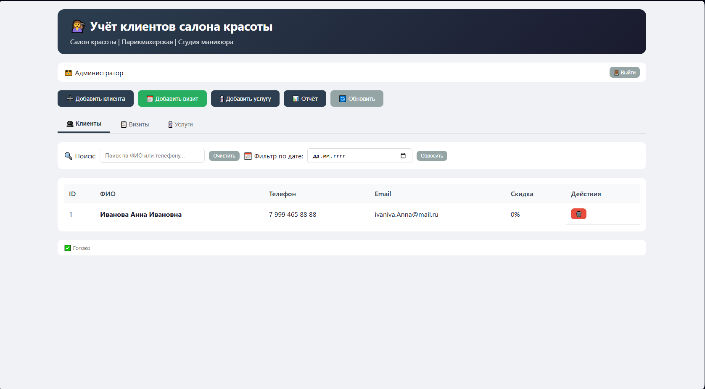
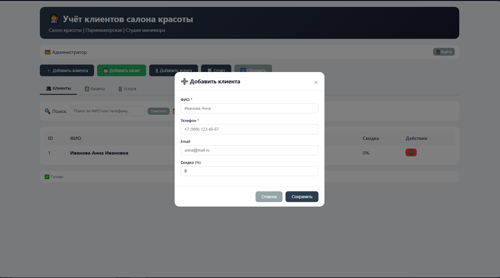
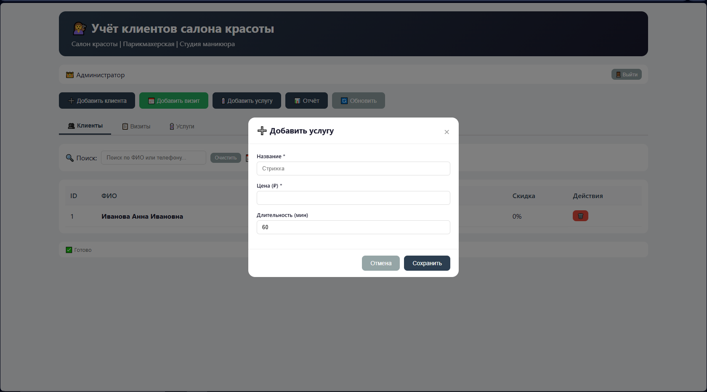
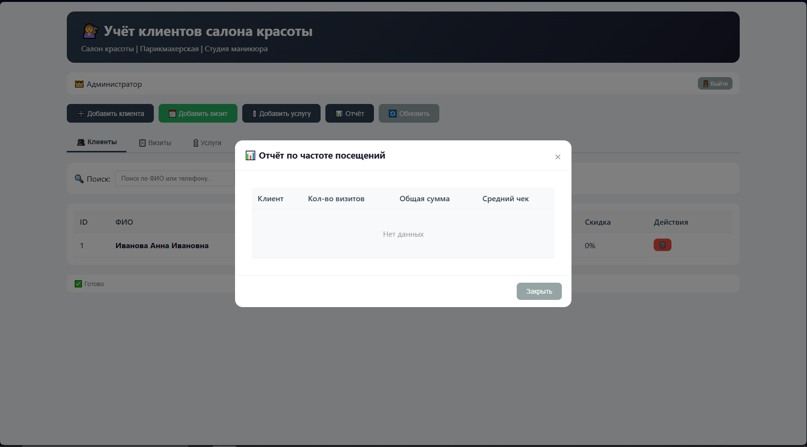

# SalonApp2
# 📋 Учёт клиентов для малого бизнеса

Профессиональная веб-система для автоматизации учёта клиентов, визитов и услуг в салонах красоты, парикмахерских, студиях маникюра и автосервисах.

## 📸 Скриншоты

  
  
  
  

## ✨ Основные возможности

### 👥 Управление клиентами

- **Картотека клиентов**: Добавление, редактирование и удаление клиентов
- **Детальные профили**: ФИО, телефон, email, скидка
- **Поиск и фильтрация**: Быстрый поиск по ФИО или телефону
- **История взаимодействия**: Полный журнал всех визитов клиента

### 📅 Учёт визитов и услуг

- **Календарь визитов**: Фиксация даты посещения
- **Множественные услуги**: Выбор нескольких услуг за один визит
- **Автоматический расчёт**: Мгновенный подсчёт итоговой суммы
- **Статус оплаты**: Отслеживание оплаты (оплачено/частично/не оплачено)

### 💈 Управление услугами

- **Прайс-лист**: Добавление и редактирование услуг
- **Фиксация цен**: Цена услуги сохраняется на момент визита
- **Длительность**: Учёт времени оказания услуги

### 📊 Отчёты и аналитика

- **Частота посещений**: Рейтинг наиболее активных клиентов
- **Финансовая аналитика**: Общая выручка, количество визитов, средний чек
- **Ролевой доступ**: Разные отчёты для администратора, мастера и владельца

## 👑 Роли пользователей

| Роль | Значок | Доступные функции |
|------|--------|-------------------|
| **Администратор** | 👑 | Полный доступ: CRUD клиентов, визитов, услуг |
| **Мастер** | ✂️ | Работа с клиентской базой и визитами |
| **Владелец** | 📊 | Финансовые отчёты и аналитика |

> **Пароль для входа:** `123` (для всех ролей)

## 🚀 Технические особенности

### Архитектура

- **3‑tier архитектура**: UI → BLL → DAL
- **Vanilla JavaScript**: Без фреймворков, максимальная производительность
- **IndexedDB**: Локальное хранение данных (аналог SQLite в браузере)
- **Modular Design**: Чистая архитектура с разделением ответственности

### UI/UX

- **Адаптивный дизайн**: Полная поддержка мобильных устройств
- **Тёмная тема**: Стильный минималистичный дизайн
- **Модальные окна**: Удобные формы для ввода данных
- **Статус-бар**: Визуальная обратная связь о действиях

  📄 Лицензия
MIT
